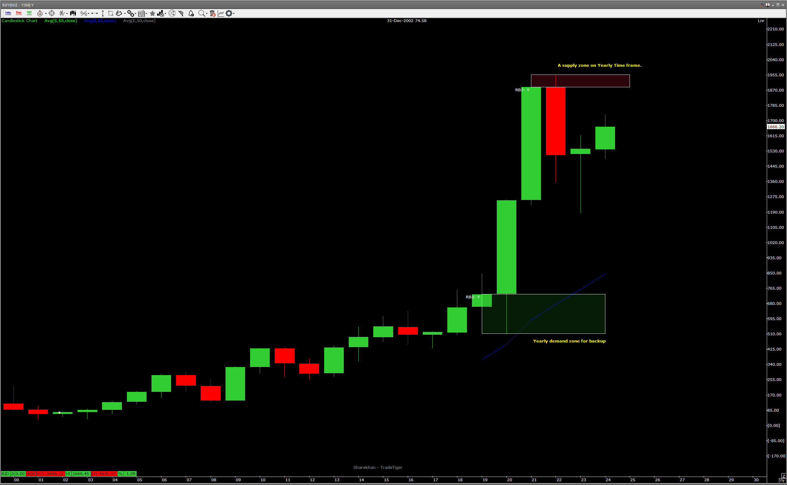
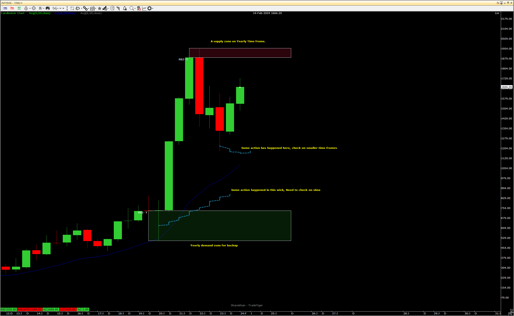
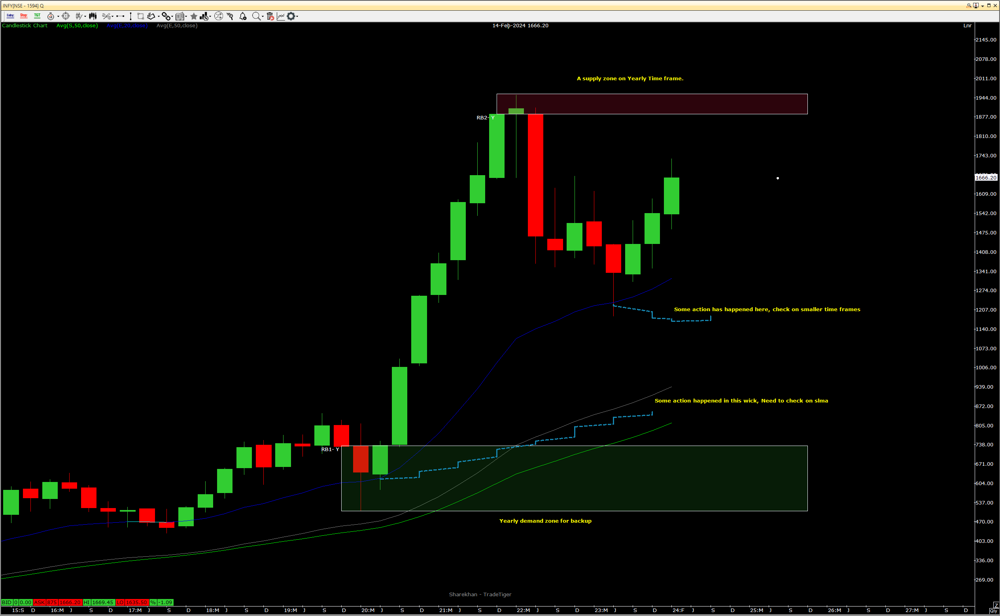
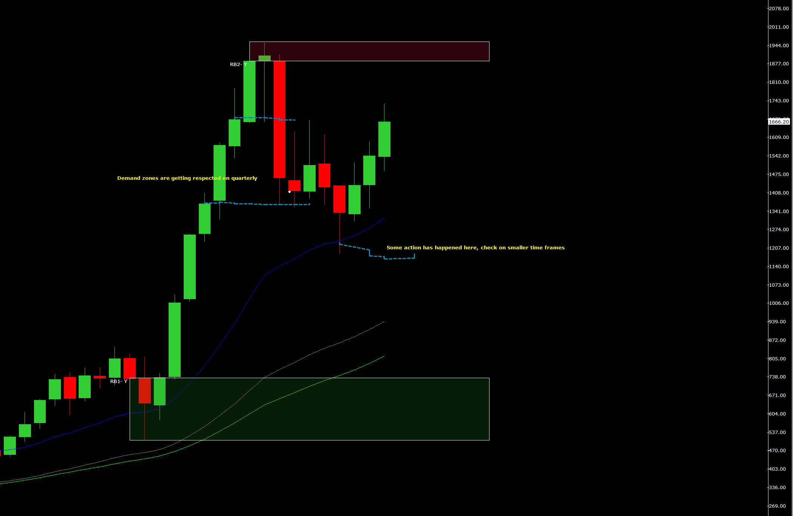
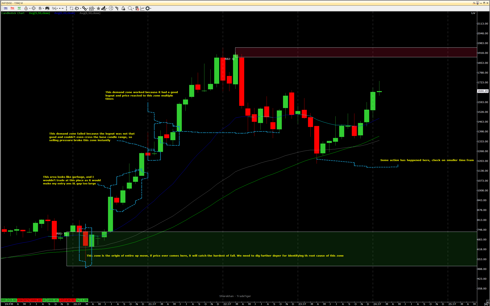
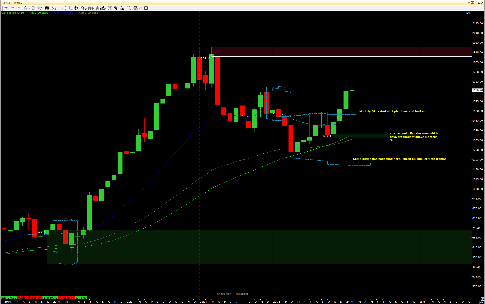
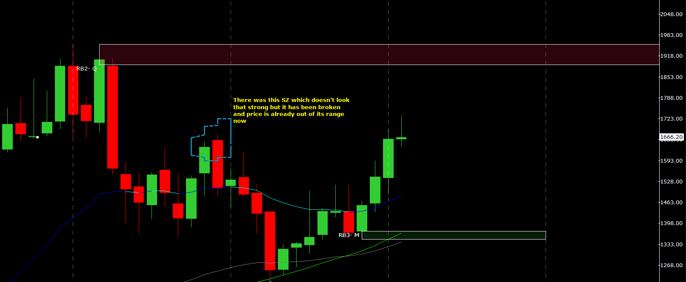
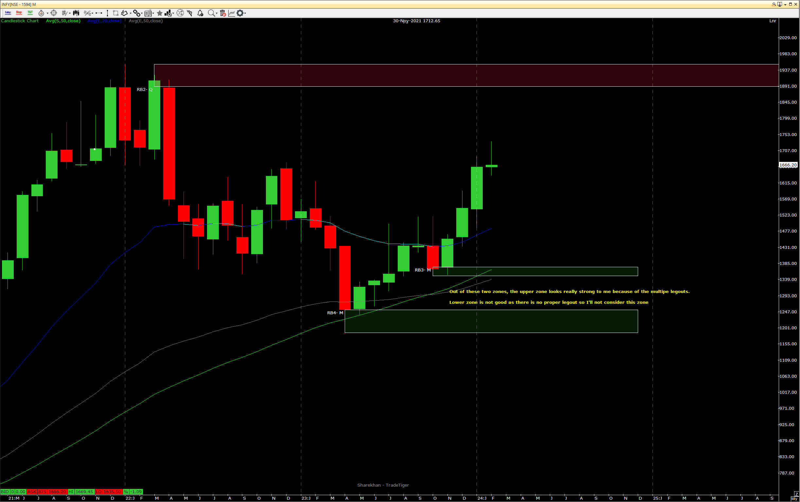
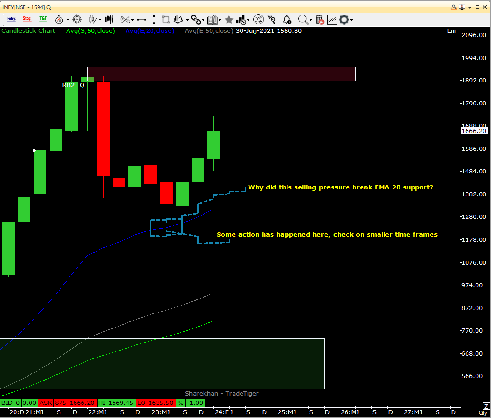
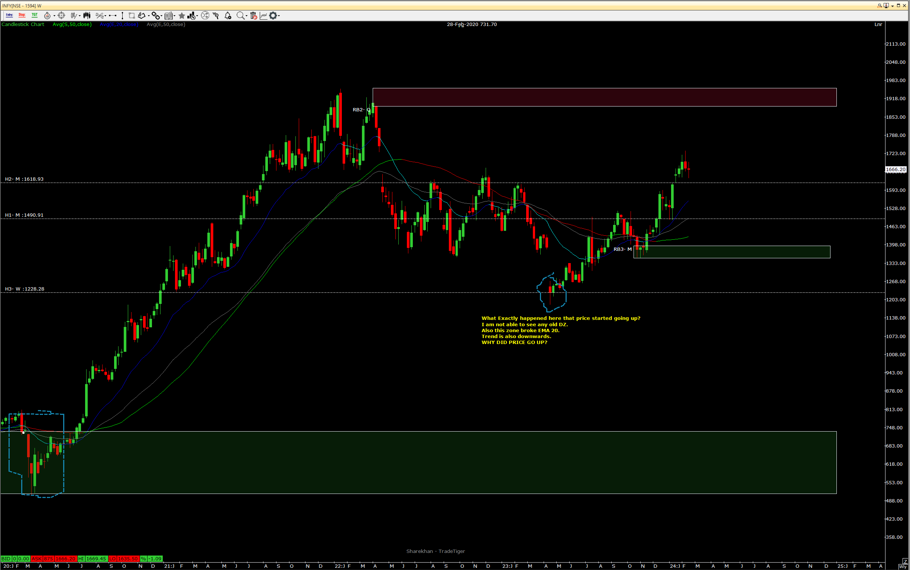

## Top Down Analysis

### Yearly Time Frame

- Nothing alarming on Yearly time frame

### Half Yearly Time Frame

- I noticed some action in the candles, will need to check on smaller time frames.
- Supply zone is consistent in Y and HY

### Quarterly Time Frame

- The action seems a little clearer, Price was crashing hard in 2023 Jan quarter, but something happened in smaller time frame and price pushed back.
- There is no supply zone coming soon, nearest one is consistent on Yearly, HY, Quarterly. The zone is consistent, looks extremely strong.
- Demand zones are getting respected (see image below)   

### Monthly Time Frame

- Demand zones are being respected.
- I need to keep an eye for the zone marked in green as a backup if price ever came crashing down.
- One supply zone broken by a DZ. Looks good
- Temporary or non danger DZ broken as well by new monthly DZ. Price is currently going through that zone only
- Monthly good location but close to Bhishma.
- 
### Weekly Time Frame

### EMA-20 Markings

### Notes
### Conclusions
- There is a nice monthly demand zone formed recently, which can be considered as location.
- Bhishma is sitting around 1900 price which is far from 1666 CMP
- Trend is upwards
- No strong supply zone (duryodhan) till Bhishma.
- Bhishma is tested multiple times

### Questions
1. ***Why did this selling pressure break EMA 20 support?***   
   We should not give that much importance to EMA 20.

2. ***Follow up of above question on smaller time frame. Why did price go up from here?***
   
3. 

