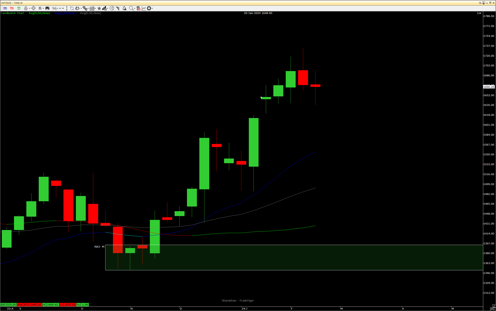
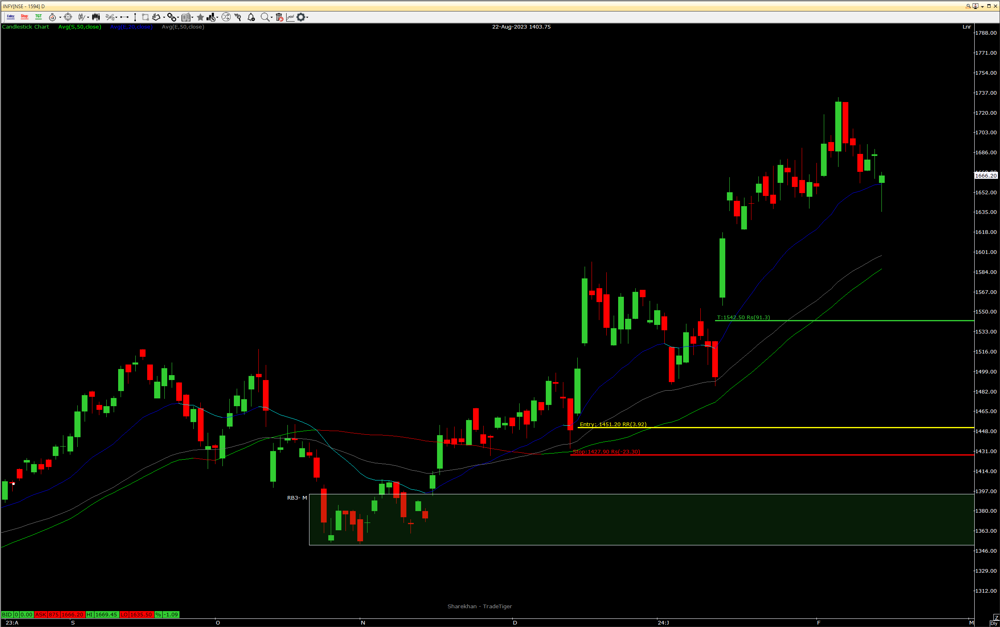
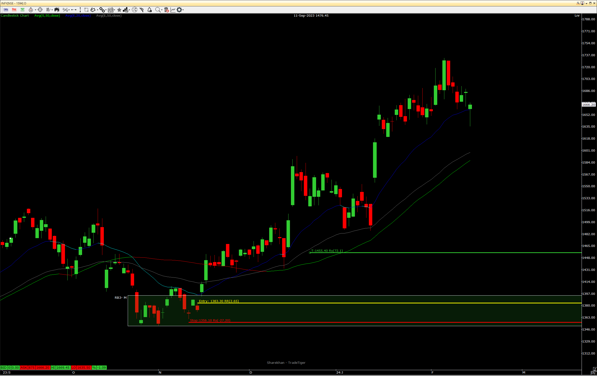

### 2024-02-14
### Type of Trade
- [ ] YIT
- [ ] HYIT
- [ ] QIT
- [x] MIT
- [ ] WIT
- [ ] DIT
- [ ] HIT

### Location
- 
### Trend
- Trend is upward on weekly
### Execution
- Execution 1:
  Trade Score: 7/7
  Notes: This execution is a little aggresive but looks good if selling pressure is not coming from Bhishma
- Execution 2:
  Trade score: 7/7
  Notes: Support of Krishna, Origin of entire upmove, Legouts are not good but can consider because of monthly location
